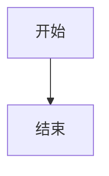

# Mermaid 图表辅助工具

**核心原则：凡是 Mermaid 支持的图表类型，必须使用 Mermaid 进行可视化表达，禁止仅以纯文本描述。**

## Instructions

### 步骤 1：识别触发场景

根据内容类型自动选择合适的图表：

| 内容类型 | 图表类型 | 触发场景 |
|----------|----------|----------|
| 流程/工作流 | flowchart | 流程描述、决策分支、算法步骤、业务流程 |
| 系统交互 | sequenceDiagram | API 调用、模块通信、请求响应、系统交互 |
| 类关系 | classDiagram | 继承关系、对象结构、接口定义、模块依赖 |
| 状态流转 | stateDiagram-v2 | 状态转换、生命周期、状态机、任务状态 |
| 数据关系 | erDiagram | 数据库表关系、实体关联、数据模型 |
| 时间规划 | gantt | 项目计划、任务排期、里程碑规划 |
| 时间线 | timeline | 历史事件、版本记录、发展历程 |
| 占比数据 | pie | 数据分布、统计比例、占比分析 |
| 目录结构 | mindmap | 文件夹结构、知识体系、模块划分 |
| 分支策略 | gitGraph | Git 分支、版本演进、合并流程 |
| 用户旅程 | journey | 用户体验流程、操作路径、服务触点 |
| 四象限分析 | quadrantChart | 优先级矩阵、SWOT 分析 |

### 步骤 2：输出格式要求

**必须使用 Markdown 代码块语法：**

````markdown

````

**格式要点：**
- 必须使用三个反引号 `` ``` `` 开启代码块
- 必须在起始反引号后紧跟语言标识符 `mermaid`
- 必须使用三个反引号 `` ``` `` 关闭代码块
- 代码块前后保持空行分隔

### 步骤 3：强制语法检查

**输出 Mermaid 代码前，必须执行以下检查：**

- [ ] 图表类型声明正确
- [ ] 节点 ID 唯一且无特殊字符（使用下划线代替连字符）
- [ ] 连接线语法正确
- [ ] 节点形状语法正确
- [ ] 标签文本正确包裹
- [ ] 子图/区块正确闭合
- [ ] 注释语法正确（使用 `%%`）

**禁止输出未经验证的 Mermaid 代码。**

## References

详细语法规范请参阅 `references/` 目录：

| 文件 | 内容 |
|------|------|
| [flowchart.md](references/flowchart.md) | 流程图语法 |
| [sequence-diagram.md](references/sequence-diagram.md) | 时序图语法 |
| [class-diagram.md](references/class-diagram.md) | 类图语法 |
| [state-diagram.md](references/state-diagram.md) | 状态图语法 |
| [er-diagram.md](references/er-diagram.md) | 实体关系图语法 |
| [gantt.md](references/gantt.md) | 甘特图语法 |
| [pie.md](references/pie.md) | 饼图语法 |
| [mindmap.md](references/mindmap.md) | 思维导图语法 |
| [git-graph.md](references/git-graph.md) | Git 图语法 |
| [timeline.md](references/timeline.md) | 时间线语法 |
| [journey.md](references/journey.md) | 用户旅程图语法 |
| [quadrant-chart.md](references/quadrant-chart.md) | 象限图语法 |
| [common-errors.md](references/common-errors.md) | 常见错误 |
