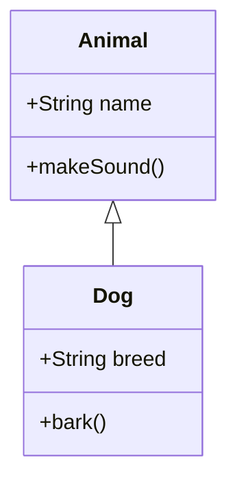

# 类图 (classDiagram)

## 类定义

```
class ClassName {
    +publicAttr: Type
    -privateAttr: Type
    #protectedAttr: Type
    +publicMethod()
    -privateMethod()
}
```

## 访问修饰符

| 符号 | 访问级别 |
|------|----------|
| `+` | Public |
| `-` | Private |
| `#` | Protected |
| `~` | Package/Internal |

## 关系类型

| 语法 | 关系类型 | 说明 |
|------|----------|------|
| `A <|-- B` | 继承 | B 继承 A |
| `A *-- B` | 组合 | 强拥有关系 |
| `A o-- B` | 聚合 | 弱拥有关系 |
| `A --> B` | 关联 | 一般关联 |
| `A -- B` | 连接 | 实线连接 |
| `A <.. B` | 依赖 | B 依赖 A |
| `A <|.. B` | 实现 | B 实现 A |

## 示例


