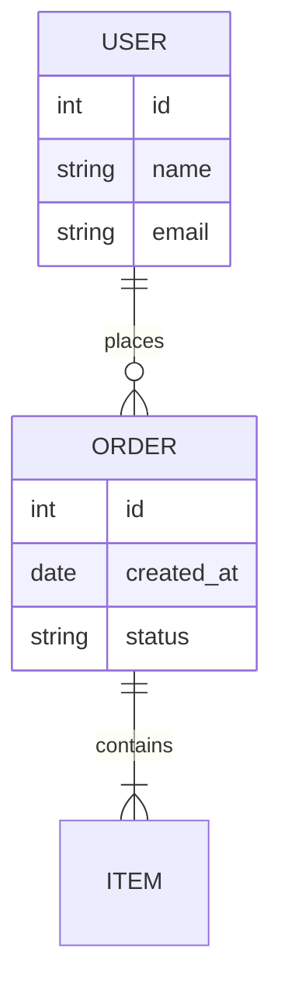

# 实体关系图 (erDiagram)

## 关系符号

| 语法 | 关系类型 |
|------|----------|
| `||--||` | 一对一 |
| `||--o{` | 一对多 |
| `||--|{` | 一对多(必须) |
| `o|--o{` | 零或多对零或多 |
| `}o--o{` | 多对多 |

## 实体定义

```
ENTITY {
    type attribute
}
```

## 属性类型

| 类型 | 说明 |
|------|------|
| `string` | 字符串 |
| `int` | 整数 |
| `float` | 浮点数 |
| `bool` | 布尔值 |
| `date` | 日期 |

## 示例


