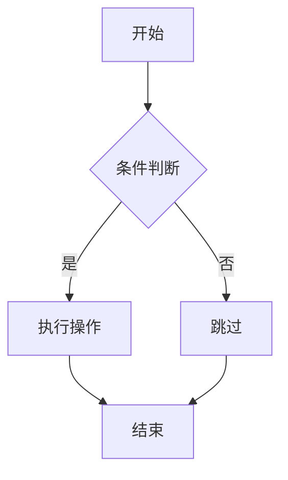

# 流程图 (flowchart)

## 方向声明

```
flowchart TD    # 自上而下
flowchart BT    # 自下而上
flowchart LR    # 从左到右
flowchart RL    # 从右到左
```

## 节点形状

| 语法 | 形状 | 示例 |
|------|------|------|
| `A[矩形]` | 方括号 | 矩形节点 |
| `B(圆角矩形)` | 圆括号 | 圆角矩形节点 |
| `C((圆形))` | 双圆括号 | 圆形节点 |
| `D{菱形}` | 花括号 | 菱形节点 |
| `E[[子程序]]` | 双方括号 | 子程序节点 |
| `F[(数据库)]` | 圆括号方括号 | 数据库形状 |
| `G>旗帜]` | 尖括号 | 旗帜形状 |
| `H{{六边形}}` | 双花括号 | 六边形节点 |

## 连接线类型

| 语法 | 说明 |
|------|------|
| `A --> B` | 实线箭头 |
| `A --- B` | 实线无箭头 |
| `A -.-> B` | 虚线箭头 |
| `A ==> B` | 粗线箭头 |
| `A --o B` | 圆圈终点 |
| `A --x B` | 叉号终点 |
| `A -- 文字 --> B` | 带文字连接 |

## 子图

```
subgraph 子图名称
    A --> B
end
```

## 示例


