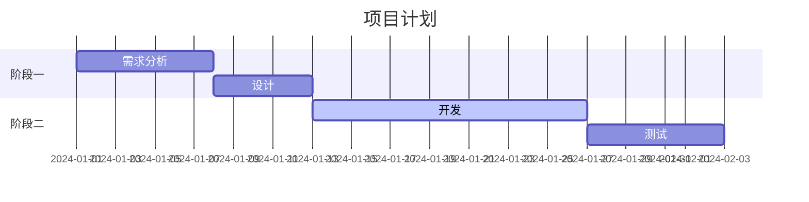

# 甘特图 (gantt)

## 基本语法

```
gantt
    title 标题
    dateFormat YYYY-MM-DD
    section 区段
    任务名 :id, 开始日期, 持续天数
    任务名 :id2, after id, 持续天数
```

## 日期格式

| 格式 | 示例 |
|------|------|
| `YYYY-MM-DD` | 2024-01-01 |
| `YYYY/MM/DD` | 2024/01/01 |
| `DD-MM-YYYY` | 01-01-2024 |

## 状态标记

| 语法 | 状态 |
|------|------|
| `:a1, 2024-01-01, 7d` | 默认（待处理） |
| `:active, a2, after a1, 5d` | 进行中 |
| `:done, a3, after a2, 3d` | 已完成 |
| `:crit, a4, after a3, 2d` | 关键任务 |

## 示例


