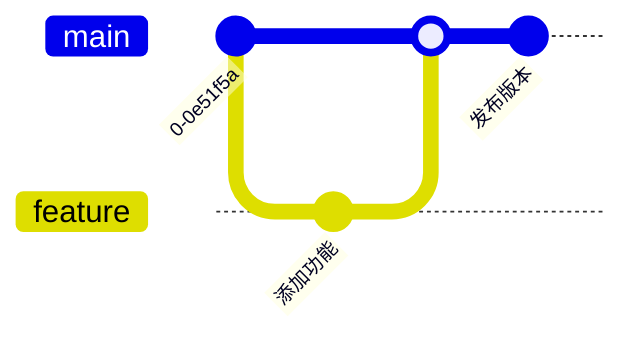

# Git 图 (gitGraph)

## 基本语法

```
gitGraph
    commit
    branch feature
    checkout feature
    commit
    checkout main
    merge feature
```

## 命令列表

| 命令 | 说明 |
|------|------|
| `commit` | 提交 |
| `commit id: "消息"` | 带消息提交 |
| `branch 分支名` | 创建分支 |
| `checkout 分支名` | 切换分支 |
| `merge 分支名` | 合并分支 |
| `cherry-pick 提交id` | 摘取提交 |

## 示例


