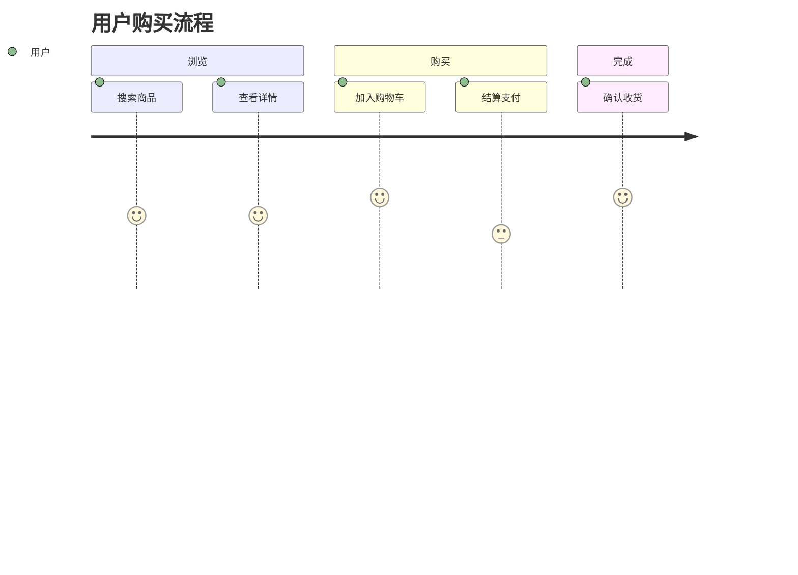

# 用户旅程图 (journey)

## 基本语法

```
journey
    title 标题
    section 阶段名
      步骤名: 分数: 角色
```

## 分数说明

| 分数 | 情绪状态 |
|------|----------|
| 1-2 | 消极 |
| 3-4 | 中性 |
| 5 | 积极 |

## 示例


```mermaid
journey
    title 用户购买流程
    section 浏览
      搜索商品: 4: 用户
      查看详情: 4: 用户
    section 购买
      加入购物车: 5: 用户
      结算支付: 3: 用户
    section 完成
      确认收货: 5: 用户
```
