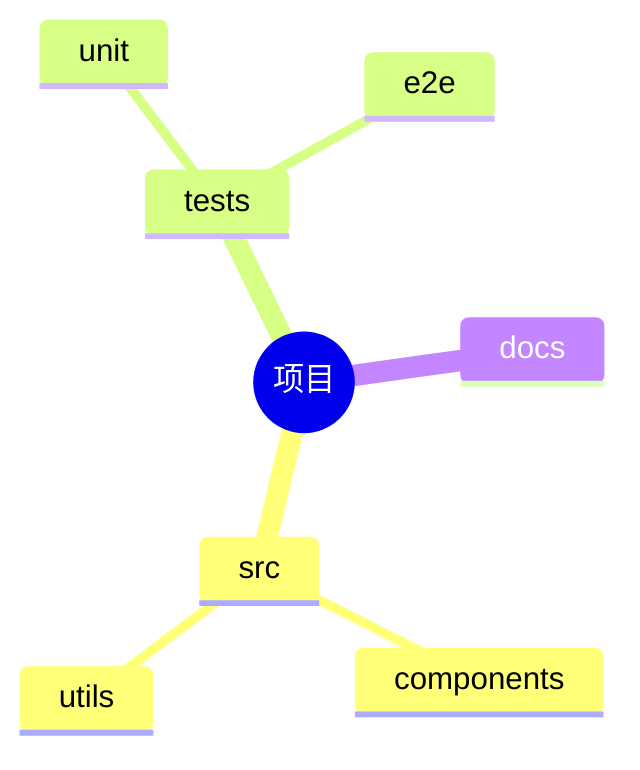

# 思维导图 (mindmap)

## 基本语法

```
mindmap
  root((中心主题))
    分支A
      子分支A1
      子分支A2
    分支B
      子分支B1
```

## 节点形状

| 语法 | 形状 |
|------|------|
| `root((圆形))` | 圆形根节点 |
| `节点` | 默认矩形 |
| `节点))` | 圆形 |
| `节点)` | 圆角矩形 |
| `节点]` | 方括号 |

## 示例


