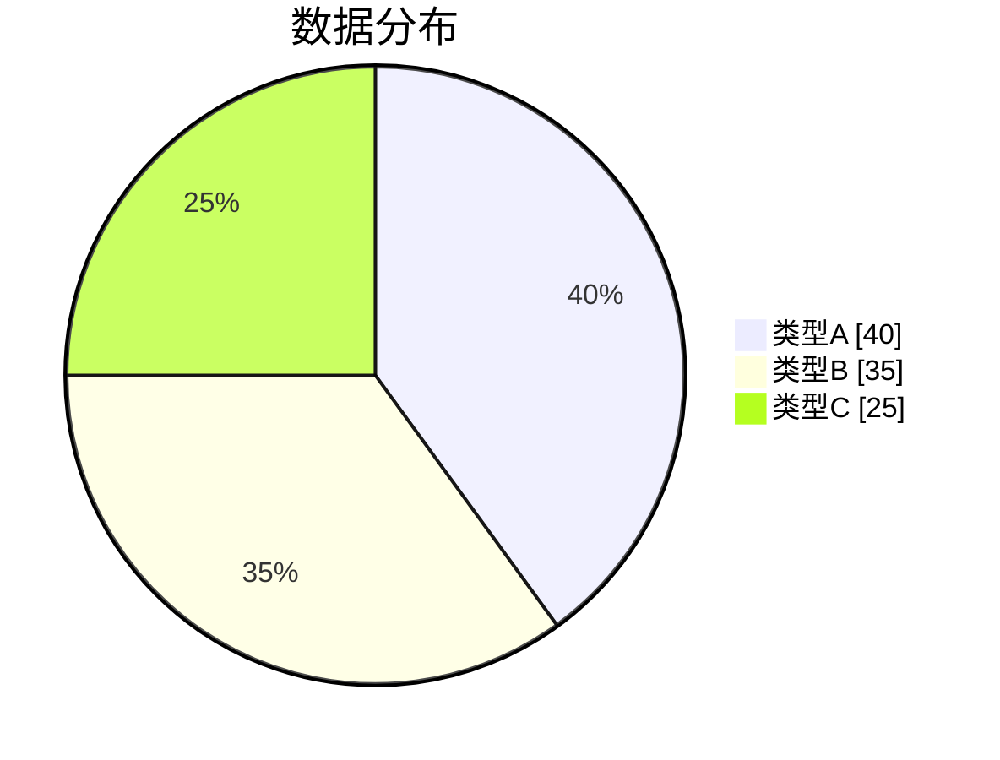

# 饼图 (pie)

## 基本语法

```
pie showData
    title 标题
    "类别A" : 40
    "类别B" : 35
    "类别C" : 25
```

## 配置选项

| 选项 | 说明 |
|------|------|
| `showData` | 显示数据值 |
| `title` | 图表标题 |

## 示例


```mermaid
pie showData
    title 数据分布
    "类型A" : 40
    "类型B" : 35
    "类型C" : 25
```
