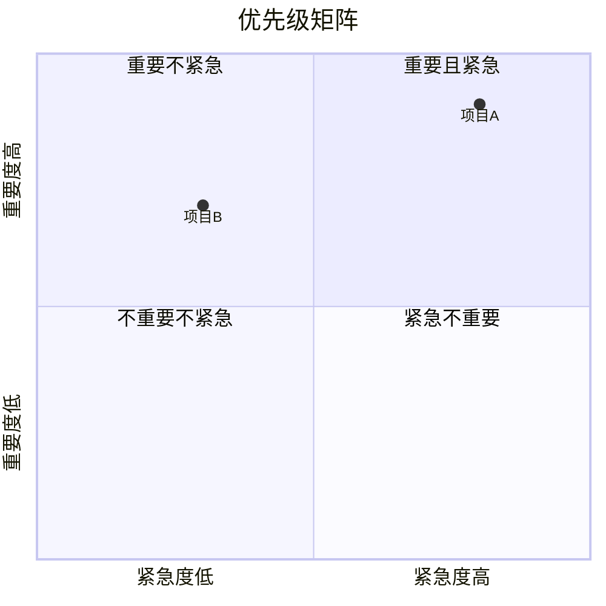

# 象限图 (quadrantChart)

## 基本语法

```
quadrantChart
    title 标题
    x-axis 低 --> 高
    y-axis 低 --> 高
    quadrant-1 第一象限
    quadrant-2 第二象限
    quadrant-3 第三象限
    quadrant-4 第四象限
    项目名: [x坐标, y坐标]
```

## 坐标范围

- x 轴：0.0 到 1.0
- y 轴：0.0 到 1.0

## 示例


