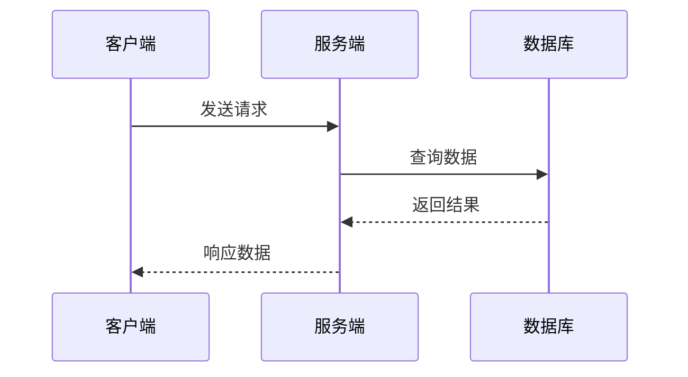

# 时序图 (sequenceDiagram)

## 参与者声明

```
participant A as 参与者A
actor B as 角色B
```

## 消息类型

| 语法 | 说明 |
|------|------|
| `A->>B : 消息` | 实线箭头 |
| `A-->>B : 消息` | 虚线箭头 |
| `A-)B : 消息` | 异步消息 |
| `A-xB : 消息` | 失败消息 |

## 激活框

```
activate A
A->>B
deactivate A

# 或简写
A->>+B
B-->>-A
```

## 循环/条件

### 循环

```
loop 循环说明
    A->>B
end
```

### 条件分支

```
alt 条件A
    A->>B
else 条件B
    A->>C
end
```

## 示例


