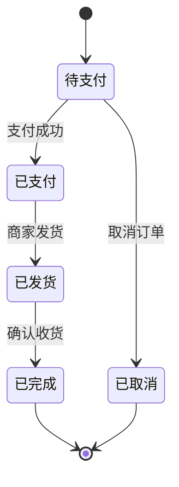

# 状态图 (stateDiagram-v2)

## 基本语法

```
stateDiagram-v2
    [*] --> 状态A
    状态A --> 状态B : 转换条件
    状态B --> [*]
```

## 状态节点

| 语法 | 说明 |
|------|------|
| `[*]` | 开始/结束状态 |
| `状态名` | 普通状态 |
| `state "状态名" as 别名` | 带别名的状态 |

## 复合状态

```
stateDiagram-v2
    state 父状态 {
        state 子状态A
        state 子状态B
    }
```

## 转换条件

```
状态A --> 状态B : 触发事件 [条件] / 动作
```

## 示例


