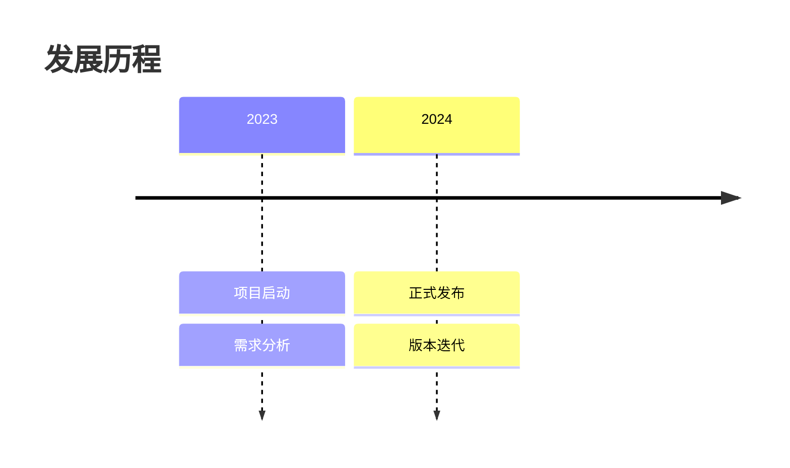

# 时间线 (timeline)

## 基本语法

```
timeline
    title 标题
    年份 : 事件1
         : 事件2
    年份 : 事件3
```

## 示例


```mermaid
timeline
    title 发展历程
    2023 : 项目启动
         : 需求分析
    2024 : 正式发布
         : 版本迭代
```
