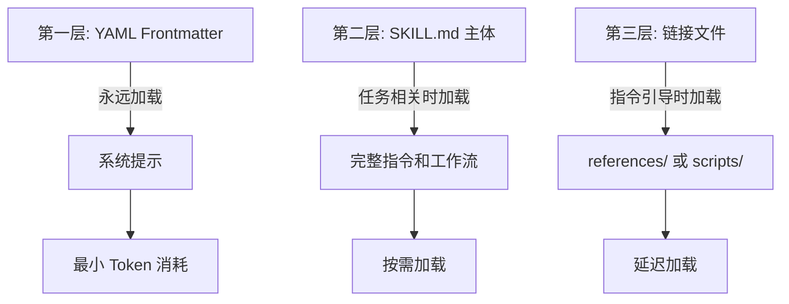
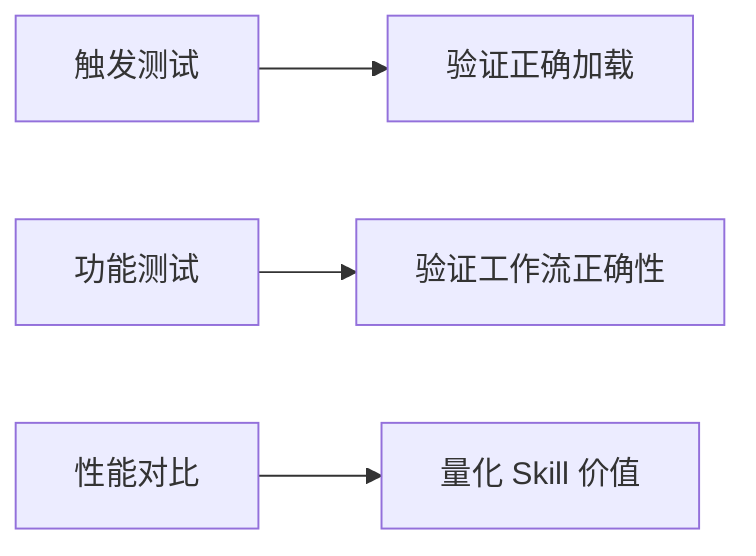
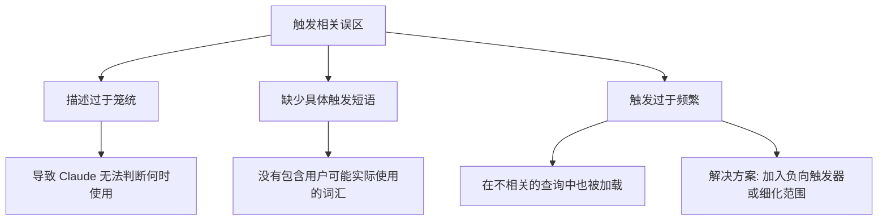

# Skill 标准设计架构规范

## 一、Skill 官方定义

一个 Skill 是一个封装了特定任务或工作流指令集的简单文件夹。它让 Agent 只需学习一次，就能在后续所有交互中重复使用你的偏好、流程和领域知识。

Skill 是连接"用户意图"和"底层工具"的智能胶水层。它教会 Agent 不仅"能做什么"，更重要的是"应该如何一步步地、高质量地完成"。

## 二、文件夹结构规范

一个标准的 Skill 是一个包含以下内容的文件夹：

```
your-skill-name/
├── SKILL.md          # 必需：核心指令文件，包含 YAML 元数据
├── scripts/          # 可选：可执行脚本 (Python, Bash 等)
├── references/       # 可选：供 Skill.md 按需读取的参考文档
└── assets/           # 可选：用于生成结果的模板、图标等资源
```

### 文件夹与文件命名规范

- **技能文件夹**：必须使用短横线命名法 (kebab-case)，例如 `notion-project-setup`。禁止使用空格、下划线或大写字母。
- **核心文件**：必须被准确命名为 `SKILL.md`（区分大小写）。
- **禁止 README.md**：技能文件夹内不应包含 README.md，所有面向 Claude 的文档都应在 SKILL.md 或 references/ 目录中。

## 三、核心设计原则

### 原则一：渐进式披露 (Progressive Disclosure)

这是 Skill 最精妙的设计，旨在最大化能力、最小化 Token 消耗。它分为三层：



- **第一层 (YAML Frontmatter)**：永远加载在系统提示中，只包含最核心的名称和描述，让 Agent 知道"何时"该用你。
- **第二层 (SKILL.md 主体)**：当 Agent 认为 Skill 与当前任务相关时才会加载，包含完整的指令和工作流。
- **第三层 (链接文件)**：references/ 或 scripts/ 目录中的文件，只有在 Skill 指令引导 Claude 去读取时才会被加载。

### 原则二：可组合性 (Composability)

Agent 可以同时加载多个 Skill。这意味着你的 Skill 需要像一个行为良好的微服务，专注于做好一件事，并能与其他 Skill 协同工作，而不是假设自己是系统中唯一的能力。

例如：一个"日志查询" Skill 可以和一个"代码审查" Skill 组合，实现从问题分析到代码定位修复的自动化闭环。

### 原则三：可移植性 (Portability)

一次创建，处处运行。一个标准的 Skill 能够在所有支持的环境中（如 Claude.ai 网页版、Claude Code 开发环境，以及通过 API 调用）无需修改即可一致地工作，前提是目标环境满足其依赖项（如特定的系统软件包或网络访问）。

## 四、构建高质量 Skill 的工程实践

### 4.1 设计理念

一个健壮的 Skill 应该遵循以下软件工程原则：

#### 原子化与单一职责

一个 Skill 应该只做好一件定义明确的事情。避免创建一个"万能"的 Skill，它会变得难以维护和触发。例如，将"项目管理"拆分为"创建冲刺计划"、"生成项目周报"、"同步任务状态"等多个更小的 Skill。

#### 稳定的输入输出契约

Skill 的触发条件和执行结果应该是可预测的。这不仅仅是技术要求，更是用户信任的基础。你的 SKILL.md 的 description 字段就是这个契约最重要的部分。

#### 状态管理与幂等性

如果 Skill 执行的是有副作用的操作（如创建、删除），需要考虑幂等性。多次执行同一个 Skill 不应该导致意外的重复操作。工作流中应包含检查"是否已存在"的逻辑。

#### 可监控与可观测

Skill 的执行过程应该像任何后端服务一样是可观测的。在 Skill 指令中明确定义关键步骤的日志输出格式，可以帮助你快速定位问题。

**核心要点**：把 Skill 当作一个"微服务"来设计。它的 SKILL.md 就是 API 文档，scripts/ 目录就是业务逻辑实现，references/ 则是外部依赖文档。

### 4.2 接口与数据契约

#### YAML 元数据：触发的"大脑"

SKILL.md 文件头部的 YAML Front Matter 是整个 Skill 中最重要的部分，它直接决定了 Claude 是否会以及何时加载你的 Skill。

**最小必需格式**：

```yaml
---
name: your-skill-name
description: What it does. Use when user asks to [specific phrases].
---
```

#### 如何编写高效的 description

description 字段是渐进式披露的第一环，其核心任务是清晰地告诉 Agent 两件事：这个 Skill 是做什么的，以及什么时候应该使用它。

**官方推荐结构**：`[它做什么] + [何时使用] + [关键能力]`

**好的示例**：

```yaml
# Good: 具体且可操作，包含触发短语
description: Analyzes Figma design files and generates developer handoff documentation. Use when user uploads .fig files, asks for "design specs", "component documentation", or "design-to-code handoff".

# Good: 包含用户可能提及的任务
description: Manages Linear project workflows including sprint planning, task creation, and status tracking. Use when user mentions "sprint", "Linear tasks", "project planning", or asks to "create tickets".
```

**糟糕的示例**：

```yaml
# Bad: 过于模糊
description: Helps with projects.

# Bad: 缺少触发条件
description: Creates sophisticated multi-page documentation systems.
```

#### SKILL.md 主体：清晰的指令是关键

在 YAML 元数据之后，便是用 Markdown 编写的实际指令。官方推荐包含指令 (Instructions)、示例 (Examples) 和故障排除 (Troubleshooting) 三个部分。

**指令编写最佳实践**：

1. **具体且可操作**：不要说"验证数据"，而要说"运行 `python scripts/validate.py --input {filename}` 来检查数据格式"。
2. **包含错误处理**：明确指出当某个步骤失败时（如 MCP 连接失败、API 返回错误），应该如何处理。例如，"如果你看到 'Connection refused'，请检查 MCP 服务器是否正在运行"。
3. **清晰引用捆绑资源**：如果 Skill 包含 references/ 目录，应在指令中明确引导 Agent 何时去查阅它们。例如，"在编写查询前，请查阅 references/api-patterns.md 以了解速率限制指南"。
4. **善用渐进式披露**：保持 SKILL.md 主体指令的简洁性，将冗长的文档、复杂的示例或详细的 API 定义移至 references/ 目录中，并通过链接引用。

### 4.3 安全与合规

当 Skill 开始执行真实世界的操作时，安全成为第一要务。

#### 最小权限原则

Skill 依赖的工具（MCP/Tools）应该只被授予完成其任务所必需的最小权限。

#### 敏感操作确认

对于删除数据、发起支付等高风险操作，Skill 的工作流中应强制包含一个"人机协作闭环"，即在执行前向用户明确请求确认。

#### 失败安全 (Fail-safe) 与降级路径

当工作流中某一步失败时，Skill 需要有明确的指令来处理。是重试、回滚，还是通知用户并终止？这必须在 SKILL.md 的 Troubleshooting 部分中定义清楚。

#### 越权防护

description 字段也是一道安全防线。通过精确定义触发条件，可以防止 Skill 被恶意或无意地用于其设计范围之外的任务。

#### 安全考量

- **保护措施**：YAML 元数据中禁止使用 XML 尖括号 (`< >`)，以防止指令注入攻击。
- **权限控制**：可以在元数据中通过 `allowed-tools` 字段限制该 Skill 能够调用的工具范围，实现最小权限原则。

### 4.4 评估与测试

与传统软件测试类似，Skill 的评估也需要覆盖不同层面，官方推荐了三种测试方案：

#### 测试类型对比



| 测试类型 | 核心目标 | 方法示例 |
|---------|---------|---------|
| **触发测试**<br>(Triggering Tests) | 确保 Skill 在正确的时间被加载，且不会在不相关时被误触发 | 需要准备一个测试用例集，包含应触发和不应触发的各类用户查询。<br>- 正向用例: "帮我规划一个冲刺" → 应该触发 sprint-planning skill<br>- 反向用例: "今天天气怎么样" → 不应该触发 sprint-planning skill |
| **功能测试**<br>(Functional Tests) | 验证 Skill 的工作流是否能产出正确、API 调用是否成功，边缘情况是否能被妥善处理，且能够保持一致的结果 | 给定输入（如项目名），断言 Skill 是否成功调用了所有预期的 API，并创建了符合规范的产出物 |
| **性能对比**<br>(Performance Comparison) | 证明使用 Skill 比手动操作或纯 Prompt 更优 | 将使用 Skill 前后的情况进行对比，用预设的成功指标（如完成任务所需的消息轮次、令牌消耗、失败率）来量化 Skill 带来的价值 |

#### 实践技巧

Anthropic 推荐一个非常有效的方法——不要一开始就追求全面的测试覆盖率。更有效的方法是：

1. 先聚焦于一个有代表性且稍有挑战性的任务
2. 通过与 Agent 的反复对话、调试，直到这个任务可以被完美解决
3. 将这个成功的交互过程和最终的解决方案让 AI 帮我们提炼、固化成一个 Skill
4. 当你有了一个坚实的基础后，再扩展到更多的测试用例来保证其泛化能力

#### 错误与异常处理

健壮的 Skill 必须定义失败路径。例如，如果 API 调用失败，是应该重试、回滚，还是向用户请求更多信息？这些都应在 SKILL.md 的"故障排除"部分明确。

### 4.5 版本化与发布

当团队开始大规模构建和使用 Skill 时，规范化的管理变得至关重要。

#### 版本规范

建议在 SKILL.md 的元数据中加入 `version` 字段，便于管理和迭代。

#### 文档化

虽然 Skill 文件夹内不应有 README.md，但在托管 Skill 的代码仓库中，需要一个清晰的 README.md 文件来面向人类开发者，解释该 Skill 的用途、安装方法和使用示例。

#### 可复用封装与团队协作

- **个人使用**：用户可以在 Claude.ai 的设置中直接上传和管理自己的 Skill 文件夹（或 .zip 压缩包）。
- **组织共享**：管理员可以部署工作区范围的 Skill，实现团队内的自动更新和集中管理。
- **开放标准**：Anthropic 将 Skill 作为一项开放标准发布，鼓励其在不同 AI 平台间的移植和共享。

## 五、常见误区与避坑指南

### 五大常见误区

#### 误区一：把 Skill 当作一堆 Prompt 的集合

**纠正**：Skill 的核心是工作流，并不仅是一个简化的 Prompt，需要根据解决场景的 SOP 流程，从更系统化工程角度来完善 SKILL.md，并在文档中做好必要的处理步骤引导、引用关系的说明。

#### 误区二：无契约的自由输入

**纠正**：description 就是 Skill 的 API 契约。必须清晰地定义它能做什么、不能做什么，以及何时被触发。

#### 误区三：没有安全边界

**纠正**：任何有副作用的 Skill 都必须设计确认环节和失败回滚路径。

#### 误区四：缺少评估闭环

**纠正**：构建 Skill 只是第一步。持续地进行触发测试和功能测试，并根据失败案例进行迭代，才是成功的关键。

#### 误区五：版本漂移与无人维护

**纠正**：将 Skill 纳入团队的 Git 工作流和 MLOps/DevOps 流程中，像维护代码一样维护它。

### 误区的总结分类

#### 触发相关误区



- **描述过于笼统**：如 `description: "Helps with projects"`，导致 Claude 无法判断何时使用。
- **缺少具体触发短语**：没有在 description 中包含用户可能实际使用的词汇或任务描述。
- **触发过于频繁**：description 涵盖范围太广，导致 Skill 在不相关的查询中也被加载。
  - **解决方案**：在描述中加入负向触发器，如 `Do NOT use for...`，或让范围更具体，如从"处理文档"细化为"为合同审查处理 PDF 法律文件"。

#### 执行相关误区

- **把 Skill 当作普通提示词**：忽略了结构化指令、错误处理和渐进式披露的重要性。
- **未定义失败路径**：Skill 只考虑了"成功"的情况，一旦某个环节出错，整个流程就会崩溃或产生不可预期的结果。
- **指令模糊不清**：使用了"请妥善验证"这类模棱两可的语言，而不是给出确切的命令或检查项。
- **过度依赖长上下文**：将所有信息（数万字的参考文档）都堆砌在 SKILL.md 中，而不使用 references/ 目录进行拆分，导致性能下降和模型"惰性"。

## 六、快速上手建议

如果你想快速开始，官方建议了这样一个最小化但完整的路径：


### 步骤详解

#### 1. 识别用例

找到一个你或你的团队高频重复的多步骤任务。例如，"每周从 Jira 同步数据到 Google Sheets 并生成图表"。

#### 2. 定义成功标准

明确什么样的结果算"成功"。例如，"一个包含最新数据和三个核心图表的 Google Sheet 链接被创建"。

#### 3. 对话式原型

先不要写 Skill！直接在一个新的 Claude 对话中，通过多轮对话手动引导 Claude 完成这个任务。把需要的工具（MCP）、数据源、操作步骤都告诉它。

#### 4. 提炼成 Skill

当你成功地让 Claude 完成任务后，将整个对话过程提炼成 SKILL.md：

- 你的第一条指令 → description 的一部分
- 你提供的背景知识/API 文档 → references/ 目录
- 你引导的每个步骤 → SKILL.md 主体的指令
- 中间的 Python/Shell 脚本 → scripts/ 目录

#### 5. 本地测试

在 Claude.ai 或 Claude Code 中上传你的 Skill 文件夹，测试它是否能在新对话中被正确触发并独立完成任务。

#### 6. 迭代与分享

根据测试中发现的失败案例（如触发失败、步骤错误），迭代优化你的 SKILL.md。当它足够稳定后，通过 Git 仓库分享给你的团队。

## 七、总结

Anthropic 提出的 Skill 概念，本质上是将软件工程的最佳实践（如模块化、版本控制、API 契约）引入到与大语言模型的交互中。它提供了一种在"万能"的通用模型和"固化"的专用工具之间，构建可复用、可维护、可演进的智能工作流的有效范式。

通过这份官方指南，我们可以看到构建一个强大的 Skill 不仅仅是"写 Prompt"，更是一项严肃的工程活动。
